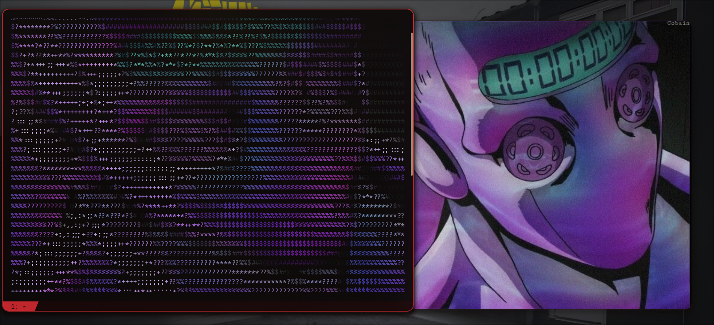
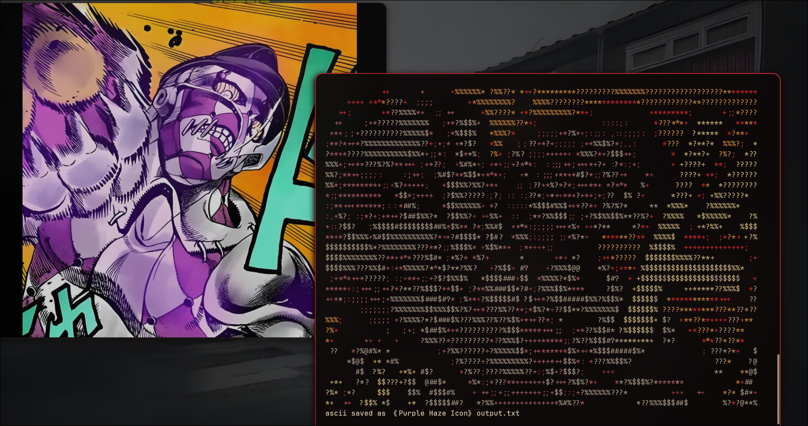
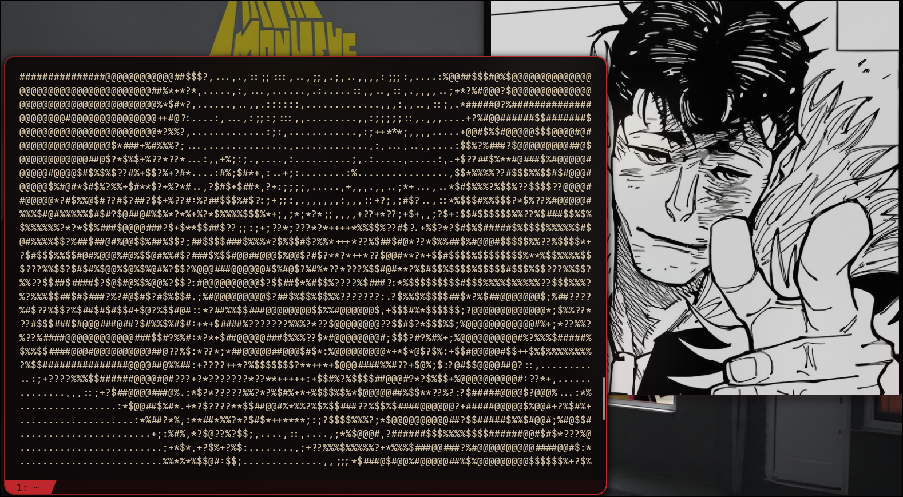

# mondrimap
> Piet Mondrian reduced the world to grids of primary colours and black lines. This reduces images to grids of characters.

Converts images to ASCII art in your terminal. Built to mess around with PIL and terminal escape codes. Supports colour output and an inverted charset for light backgrounds.

| Truecolour | Ansi Colours |
|---|---|
|  |  |

| Black and White | Gifs |
|----|-----|
|  |  |

## Install

```bash
git clone https://github.com/starcrossd/mondrimap
cd mondrimap
bash setup.sh
```

The setup script installs Pillow if needed, adds a `mondrimap` alias to your shell rc file, then deletes itself. Restart your shell or source your rc file after.

> ⚠️ Only bash and zsh are supported. Fish/other shell users will need to add the alias manually.

---

## Usage

Run without flags for interactive prompts:

```bash
mondrimap
```

You'll be asked for an image path and output width. ASCII output is printed to the terminal. Use `-s` or `-o` to save it.

### Flags

| Flag | Description |
|------|-------------|
| `-img path/to/image.png` | Image path (skips prompt) |
| `-gif path/to/anim.gif` | GIF path - pre-renders then plays on loop, `Ctrl+C` to exit |
| `-w 120` | Output width in characters (skips prompt) |
| `-fps 24` | Playback framerate for GIFs |
| `-o path/to/out.txt` | Custom output path |
| `-c` | Colour output using classic ANSI escape codes |
| `-tc` | Truecolour output (24-bit) |
| `-bg` | Apply colour to character background instead of foreground |
| `-i` | Invert charset (for light backgrounds) |
| `-s` | Save output to a file |

```bash
mondrimap -img photo.png -w 120 -tc
mondrimap -img photo.png -w 120 -tc -bg
mondrimap -gif anim.gif -w 80 -tc -fps 24
```

---

## How it works

The script resizes your image to the specified width, then maps each pixel's brightness to a character:

```
@ # $ % ? * + ; : , .
```

Dense → sparse: dark pixels get `@`, light ones get `.`. `-i` flips this for light backgrounds.

Colour mode finds the nearest ANSI colour to each pixel using Euclidean distance in RGB space, then wraps each character in the matching escape code.

GIF mode pre-renders all frames before playback starts - expect a short delay on load. Frames are then played back in a loop at the specified framerate. Close with `Ctrl+C`.

---

## Notes

- `.txt` output won't preserve colour - just the characters
- 100–150 width is usually a good sweet spot; your terminal width should match
- High contrast images work best
- `-tc` gives the best colour results; `-c` is a fallback for terminals without truecolour support
- GIFs are best viewed in a terminal that supports truecolour
